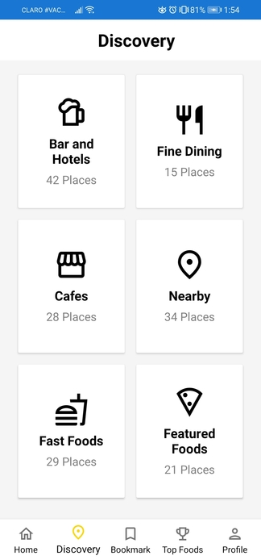

# Xamarin Styled Menu Page

Project based on practical assignment #4 for the class "Desarrollo de Aplicaciones Móviles" from INTEC. The purpose of this project was to recreate the page below using Global Styles rather than inline styles.

If you've been following this series of projects closely, you might have found the page below familiar to one made [here](https://github.com/aledeltoro/simple-mvvm-login).

## Discovery page

